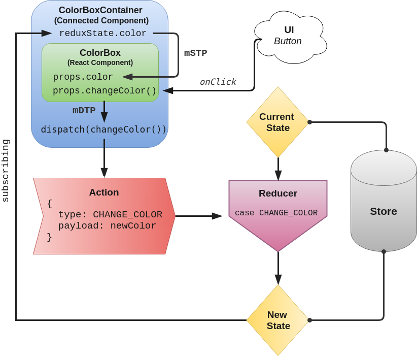

# About

This project is a simple app that changes the color of a div upon click.

The purpose of this repository is to understand the data flow in applications using React and Redux.

The code in all of the files has been annotated, and there are pretty console logs (in Google Chrome at least) that document the data flow path.

I highly recommend installing the Redux Devtools extension [here](https://chrome.google.com/webstore/detail/redux-devtools/lmhkpmbekcpmknklioeibfkpmmfibljd?hl=en) since the app is set up to support it, and it's a great resource for all Redux development needs.

Check out [these slides](https://slides.com/hueter/redux-with-react/) for a full presentation on the subject.

Here's a custom diagram I made as well:

